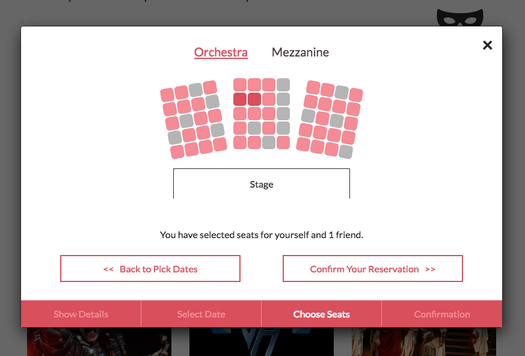

# PickupTix

[PickupTix][heroku]

[heroku]: http://www.pickuptix.io

PickupTix is a user-first, event-browsing and ticketing app designed to make finding and reserving seats to live performances
an intuitive and engaging experience. It is a full-stack app built on the following technologies:

*  Rails backend
*  React/Flux frontend
*  Postgres RDBMS

## Features & Implementation

### Just one page

PickupTix uses the React Router to keep all of its content on a single root page. While navigating the site, all relevent data
including user credentials, filter parameters, and show indices are managed in local stores. All of this is managed through a
Rails API serving JSON.

By using browser history, the user experiences the same familiar experience of being able to refresh or send out links to friends
without any issues. No gobblygook in the URL. Just a nice, clean display for prospective customers.

```ruby
Rails.application.routes.draw do
  root "static_pages#root"
  get "/events", to: "static_pages#root"

  namespace :api, defaults: { format: :json } do
    resource :user, only: [:show, :create, :destroy]
    resource :session, only: [:create, :destroy]

    resources :spectacles, only: [:index, :show]

    resources :performances, only: :show

    patch "/tickets", to: "tickets#assign_tickets"
  end
end
```

### Find only the shows you want

Filtering is handled by using the ActiveRecord to leverage Postgres' power. `Spectacle`s (avoiding words like "show" and "event"
to keep Javascript and Ruby happy) contain various columns of their own through which they may be filtered as well as associations
with their `Venue`s and `Performance`s which need to be accounted for. The filtering page assembles and stores these parameters
so that Rails can select `Spectacle`s across multiple criteria and serve them up whenever criteria change.

`Spectacle`s are served up both in a `SpectaclesIndex` as `SpectaclesIndexItem`s and in greater detail in a `SpectacleModal`. Details
like specific `Performance`s are only retrieved when the modal is opened to reduce sending down extraneous data.

One of the key tricks to achieving this is the fact that ActiveRecord queries an accept `nil` as an argument and will pass the
ActiveRecord relation through the query unaltered. This results in the simplest and most efficient query, only using the
parameters the user has specified.

```ruby
# spectacle.rb

def self.filter_by_params(params)

# ...

  self.where(*keyword_where)
      .where(category_where)
      .joins(performances_join)
      .where(performances_where)
      .joins(taggings_join)
      .where(taggings_where)
      .joins(seats_join)
      .group(seats_group)
      .having(*seats_having)
      .order(order_type)
      .limit(limit)
end
```
### Pick your own seat

PickupTix implements a seat picker which allows users to choose their own seat through an intuitive UI. The entire process is
designed to keep the ticket booking process graphically focused and to tied to the emotions of attending the event. When the user
picks a seat, they imagine themselves in it. They think about who will be sitting next to them. When they select a number of tickets,
they think about... a number.


<p style="text-align:center">
  
</p>

Getting seats to work involves abstracting out venue data a bit. PickupTix maps `Ticket`s to `Seat`s and has seats belonging to `Venue`s through `SeatBlock`s
and `Section`s. After that, a JSON package can be sent down with this nested information in order to generate the map.

```ruby
def gen_seats_matrix(tickets)
  matrix = []

  seats.each do |seat|
    matrix[seat.row] ||= []
    matrix[seat.row][seat.col] = tickets[seat.id]
  end

  { style: style, matrix: matrix }
end
```

## Future Features

The next steps in developing PickupTix include:

### Search

Searching events by their title. Work on the back end of this feature is already set up. The front end application will be built into the filter page.  

### User Shows

Users should be able to see the seats they've booked in order to tell what shows they
have coming up and what shows they've seen in the past.

### Recommendations

Using the users history, PickupTix will be able to recommend upcoming shows that match their preferences.
